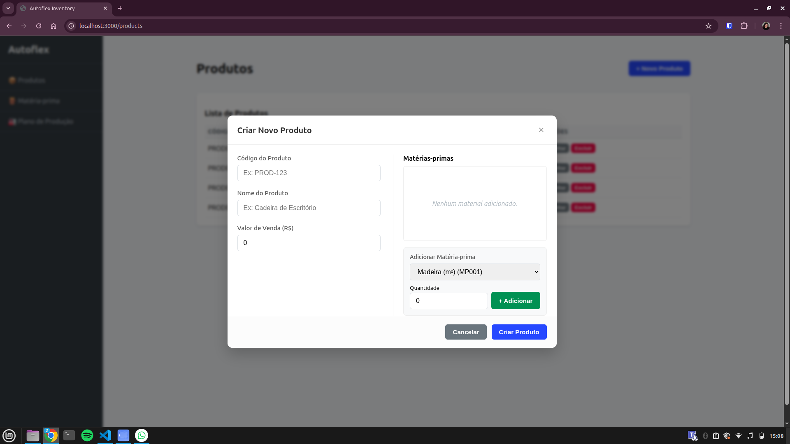
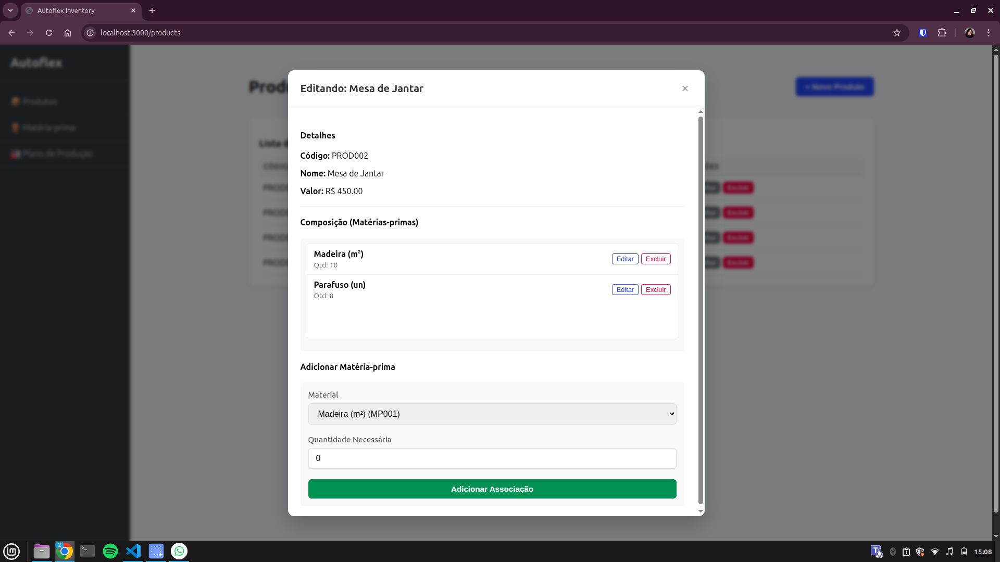
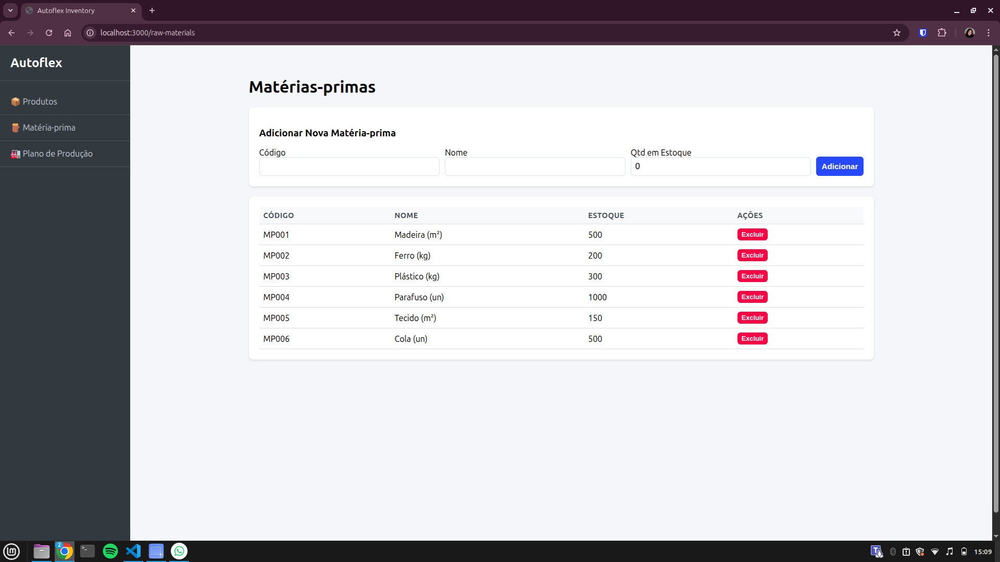
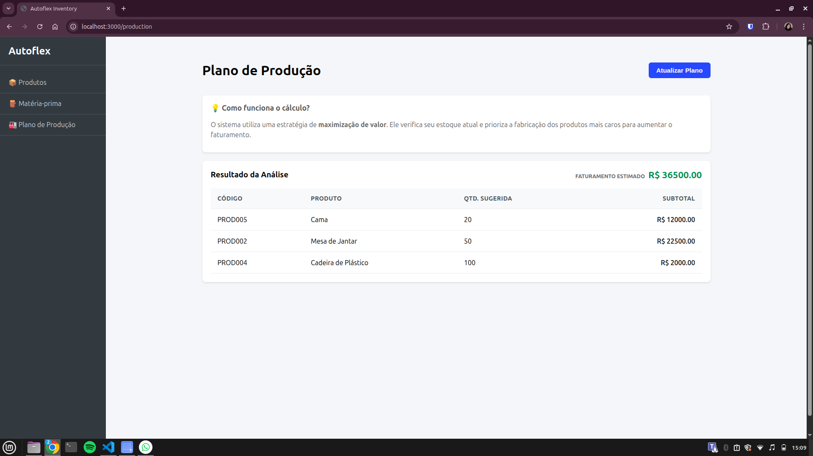
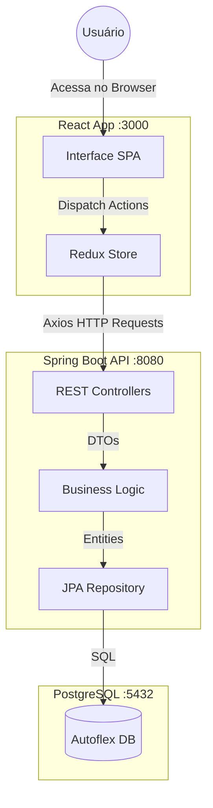
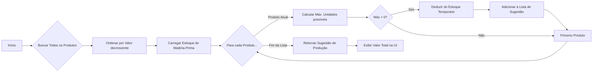

# 🏭 Sistema de Estoque Autoflex

Uma aplicação web full-stack para Gestão de Estoque e Planejamento de Produção, projetada para otimizar processos de fabricação utilizando um **Algoritmo Guloso (Greedy)** para alocação de recursos.

  

---

## 🚀 Funcionalidades Principais

*   **Gestão de Produtos**: Operações de CRUD para produtos, incluindo valor de venda e composição (Matérias-primas).
*   **Inventário de Matéria-Prima**: Monitoramento em tempo real dos níveis de estoque.
*   **Planejamento de Produção**: Um motor inteligente de "Sugestão de Produção" que utiliza uma **Estratégia Gulosa** para calcular o plano de produção ideal, maximizando o valor monetário com base no estoque disponível.
*   **Interface Interativa**: Uma UI moderna baseada em React com gerenciamento de estado via Redux.

---

## 📸 Telas do Sistema

### Gestão de Produtos

*Listagem de produtos com opções de gerenciamento.*

### Cadastro de Produtos

*Formulário para cadastro de novos produtos.*

### Edição de Produtos

*Interface para atualização de dados dos produtos.*

### Inventário de Matérias-Primas

*Visualização e controle do estoque de insumos.*

### Planejamento de Produção

*Sugestão automática de produção para maximização de lucro.*

---

## 🛠️ Tecnologias Utilizadas

### Backend
*   **Java 17** & **Spring Boot 3**
*   **JPA / Hibernate** (Persistência de Dados)
*   **PostgreSQL** (Banco de Dados Relacional)
*   **Flyway** (Migração de Banco de Dados)
*   **Lombok** (Redução de código boilerplate)

### Frontend
*   **React 18** & **TypeScript**
*   **Redux Toolkit** (Gerenciamento de Estado)
*   **React Router** (Navegação)
*   **Axios** (Cliente HTTP)

### DevOps
*   **Docker** & **Docker Compose** (Containerização)

### 📐 Arquitetura do Sistema



---

## 📋 Pré-requisitos

*   **Docker** e **Docker Compose** instalados na sua máquina.
*   (Opcional) Java 17 e Node.js se desejar rodar localmente sem Docker.

---

## 🏃‍♂️ Como Rodar

A maneira mais fácil de rodar a aplicação é usando o Docker Compose.

1.  **Clone o repositório**:
    ```bash
    git clone <repository-url>
    cd testeAutoflex
    ```

2.  **Inicie a aplicação**:
    ```bash
    docker-compose up -d --build
    ```
    *Este comando irá construir as imagens do Backend e Frontend e iniciar o banco de dados PostgreSQL.*

3.  **Acesse a aplicação**:
    *   **Frontend**: [http://localhost:3000](http://localhost:3000)
    *   **Backend API**: [http://localhost:8080/api](http://localhost:8080/api)

4.  **Pare a aplicação**:
    ```bash
    docker-compose down
    ```

---

## 📂 Estrutura do Projeto

```bash
testeAutoflex/
├── backend/                 # Aplicação Spring Boot
│   ├── src/main/java/       # Código fonte (Controllers, Services, Entities)
│   └── src/main/resources/  # Configurações e Migrations
├── frontend/                # Aplicação React
│   ├── src/components/      # Componentes UI
│   ├── src/pages/           # Views da aplicação
│   └── src/store/           # Lógica Redux
├── docker-compose.yml       # Orquestração de containers
├── documentation.md         # Arquitetura detalhada e Requisitos
└── README.md                # Entrada do projeto
```

## 🧠 Lógica de Negócio (Sugestão de Produção)

A aplicação apresenta um algoritmo especializado para sugerir a produção:



1.  **Objetivo**: Maximizar o valor monetário total da produção usando o estoque atual.
2.  **Estratégia**:
    *   Os produtos são ordenados por **Valor de Venda (Maior para Menor)**.
    *   O algoritmo itera por essa lista ordenada.
    *   Para cada produto, calcula o máximo de unidades que podem ser produzidas com o estoque *restante*.
    *   Os recursos são reservados de forma "gulosa" para os itens de maior valor primeiro.

Para uma explicação detalhada da arquitetura, esquema do banco de dados e endpoints, consulte a [documentação completa](./documentation.md).

---

## 📄 Licença

Este projeto é open-source e está disponível para fins educacionais.
